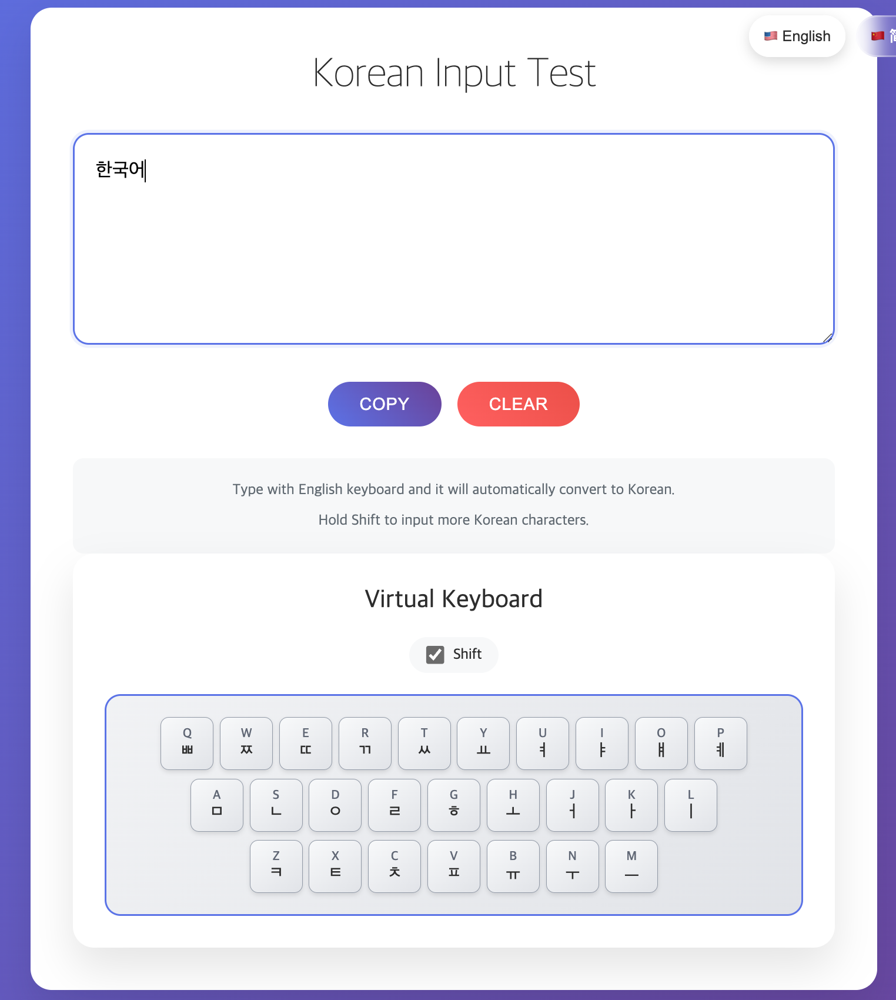

# 韩文输入键盘

一个基于Web的韩文输入工具，允许用户在英文输入法状态下直接输入韩文，无需切换系统输入法。项目包含实时字符转换、虚拟键盘显示、多语言界面等功能。

[English Document](README.md)

## 在线体验

你可以点击这里体验在线版本: [https://korean-keyboard.1tlt1.com/](https://korean-keyboard.1tlt1.com/)

## 界面截图



## 核心功能

### 1. 韩文输入转换系统
- **实时转换**：自动将英文键盘输入转换为韩文字符。
- **智能组合**：支持初声、中声、终声的自动组合规则。
- **双字符支持**：Shift键支持输入双辅音（ㅃ, ㅉ, ㄸ, ㄲ, ㅆ）和复合元音（ㅒ, ㅖ）。
- **智能退格**：根据韩文字符的组成部分进行删除，支持字符分解。

### 2. 多语言界面
- 🇺🇸 英语
- 🇨🇳 简体中文
- 🇹🇼 繁体中文
- 🇰🇷 韩语
- 语言偏好设置会自动保存到 `localStorage`。

### 3. 虚拟键盘
- **完整QWERTY布局**：显示字母键区域。
- **双层显示**：上方显示英文字母，下方显示韩文字母。
- **Shift模式切换**：支持在普通和Shift状态之间切换。
- **实时高亮**：按下物理键盘按键时，对应的虚拟按键会高亮显示。
- **点击输入**：支持通过鼠标点击虚拟按键进行输入。

### 4. 用户功能
- **复制功能**：一键将韩文内容复制到剪贴板。
- **清空功能**：快速清除所有输入内容。
- **响应式设计**：适配桌面和移动设备。

## 如何在本地运行

这是一个纯前端项目，无需特殊的服务器配置。你只需在浏览器中打开 `index.html` 文件即可运行。

为了获得更标准的开发体验，你可以使用一个简单的本地服务器。

1.  **克隆仓库** (假设你已安装 Git):
    ```bash
    git clone https://github.com/nonsensejoke/korean-keyboard.git
    cd korean-keyboard
    ```

2.  **启动服务**:
    如果你安装了 Python，可以在项目目录中运行一个简单的 Web 服务器：

    *Python 3:*
    ```bash
    python -m http.server
    ```

    *Python 2:*
    ```bash
    python -m SimpleHTTPServer
    ```

    或者，你也可以使用其他工具，如 `npx serve`。

3.  **在浏览器中打开**:
    在你的浏览器中访问 `http://localhost:8000` (或你的服务器指定的端口)。

## 技术架构

### 文件结构
```
korean-keyboard/
├── index.html          # 主页面文件
├── korean-input.js     # 韩文输入核心逻辑
├── virtual-keyboard.js # 虚拟键盘功能模块
├── i18n.js             # 多语言配置管理
├── style.css           # 样式表
└── README.md           # 项目文档
```

## 浏览器兼容性
-   ✅ Chrome 80+
-   ✅ Firefox 75+
-   ✅ Safari 13+
-   ✅ Edge 80+
